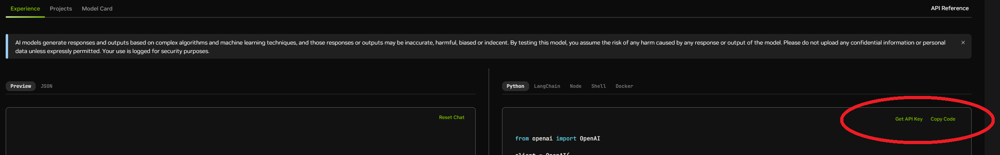
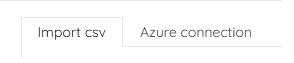
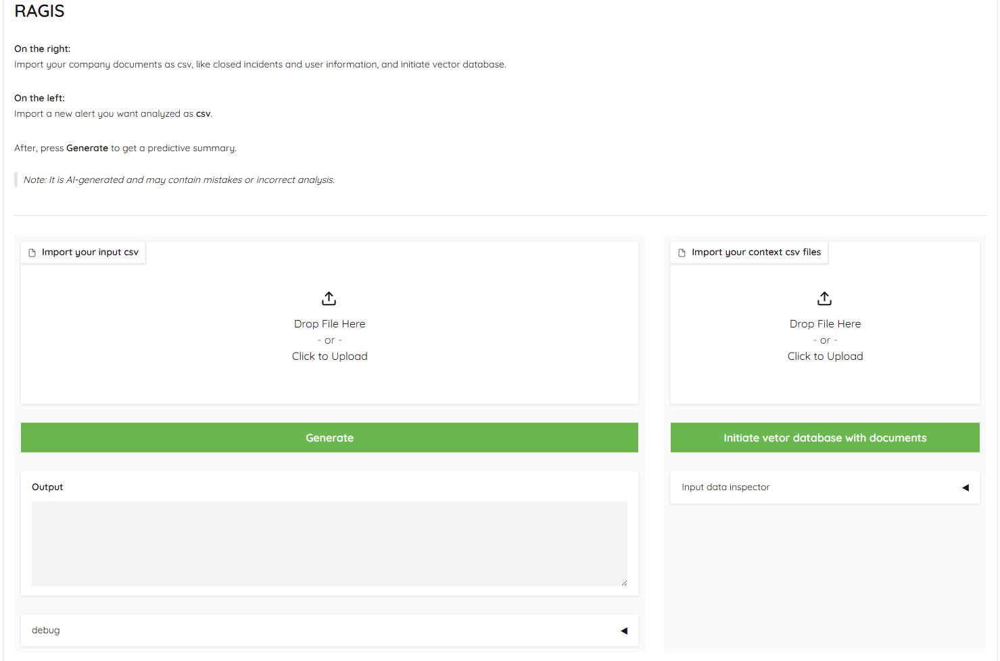
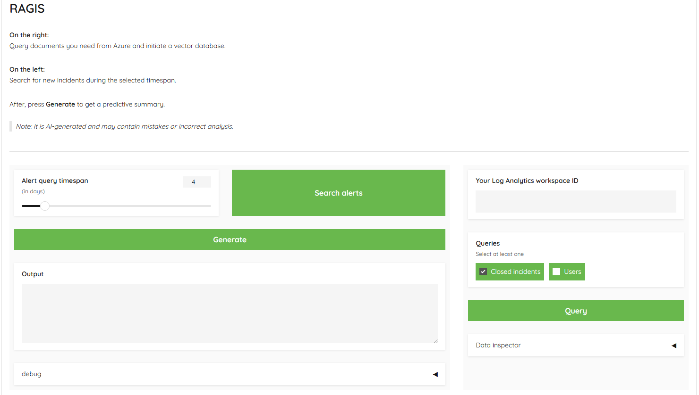

# RAGIS (Retrieval-Augmented Generation Incident Summary)
Our project, RAGIS (Retrieval-Augmented Generation Incident Summary), helps security analysts determine whether an incident is a false positive or if the incident needs further investigation. It leverages generative AI and company data such as Microsoft Entra ID user details and previously closed incidents to make accurate predictions, saving valuable time and reducing the noise from false incidents.

## Inspiration
Security analysts often spend significant time investigating false positives, which can lead to inefficiencies. [Study](https://www.ibm.com/downloads/cas/5AEDAOJN) shows that nearly a third of their time is spent on incidents that pose no actual threat. This creates alert fatigue and slows down response times, motivating us to create a solution that reduces this burden and helps analysts focus on real security threats.

## How we built it
We are using LangChain to build our RAG analyzer, Gradio as UI framework and Nvidia cloud endpoints to run models. Azure queries are done with `msgraph` and `azure.monitor.query`.

The RAG part of our app starts with `ChromaDB` vectorstore loading, where vector embedding is done with `NV-Embed-QA`. We prompt `meta/llama-3.1-70b-instruct` chat model to act as an assistant tasked with determining if an input incident is a "true positive" or "false positive", and give the retrieved documents from `ChromaDB` as context.
Retriever is parameterized to include some added diversity in the data, without sacrificing too much accuracy.

Details on the azure queries:
```
   ./code/kql_module.py
   ./code/entra_id.py
```
Using the ease and speed of AI Workbench we started the development by cloning [Nvidia-provided examples](https://docs.nvidia.com/ai-workbench/user-guide/latest/quickstart/example-projects.html) to the AI Workbench, tinkering and learning!

## Setup
To use RAGIS, you need to get an Nvidia API Key and setup NVIDIA AI Workbench. Optionally, you can also setup to [query data from Azure](#steps-for-integrating-ragis-with-azure).

#### API key
You can generate the key on any model page in the Nvidia API Catalog, for example [here](https://build.nvidia.com/meta/llama-3_1-70b-instruct).



Save the generated key somewhere for later.

#### NVIDIA AI Workbench
If you do not NVIDIA AI Workbench installed, first [follow the installation instructions](https://docs.nvidia.com/ai-workbench/user-guide/latest/installation/overview.html).
After you have successfully installed the AI Workbench, follow these steps to set up RAGIS demo:

1. Fork this project, copy the forked project URL.
   
2. Open NVIDIA AI Workbench. Select a location. 
   
3. Select **Clone Project**, paste your GitHub link to *Repository URL* and click **Clone**.
   
4. Wait for the project to build. This can take a while, for us it typically takes 1-5 minutes. 
   
5. When the build completes, set the following configurations. Starting from the left menu pane:

   * **Environment** &rarr; **Secrets** &rarr; **Add**. Specify the *Name* as `NVIDIA_API_KEY` and copy&paste the Nvidia API key you generated earlier to *Value*, click **Add**.

6. If you want to configure integration with Azure, continue to the next section. If you are fine without, rebuild the project if prompted, and click **Open Ragis-demo** in the top-right corner. All set!

#### OPTIONAL: Azure setup

<blockquote>
<details>
<summary>
Additional setup for integrating RAGIS with Azure
</summary>
    
RAGIS can be integrated with Azure to easily get all the data needed without saving copies of .csv files. RAGIS then can query background materials such as previously closed security incidents and Entra ID user details and also security incidents that are used as an input for RAGIS.

This guide provides step-by-step instructions on how to integrate RAGIS with Azure using a Service Principal in Microsoft Entra ID.

### Prerequisites

Before starting the integration process, ensure you meet the following prerequisites:

- **Azure Subscription**: You must have an active Azure Subscription.
- **Permissions**: You need sufficient permissions to create a Service Principal within Entra ID.
- **Log Analytics Workspace**: You should already have a **Log Analytics Workspace** deployed.
- **Microsoft Sentinel**: Ensure Microsoft Sentinel is deployed and connected to your Log Analytics Workspace.

### Steps for Integrating RAGIS with Azure

#### 1. Create a Service Principal in Entra ID

A Service Principal is an identity created for use with applications, hosted services, and automated tools to access Azure resources.

##### Steps to Create a Service Principal:

1. **Sign in to Azure Portal**:
   - Go to [https://portal.azure.com](https://portal.azure.com) and log in with an account that has permission to create a Service Principal in Entra ID.

2. **Access Entra ID**:
   - In the left-hand navigation pane, click on **Entra ID**.

3. **Create a New Application**:
   - In the **Entra ID** blade, select **App registrations** from the left sidebar.
   - Click on **New registration** at the top.

4. **Configure the Application**:
   - Provide a name for the Service Principal, e.g., `sp-ragis`.
   - Under **Supported account types**, select **Accounts in this organizational directory only**.
   - Click **Register** to create the Service Principal.

#### 2. Create a Client Secret

After creating the Service Principal, you need to generate a **Client Secret** that will allow the service principal to authenticate against Azure resources.

##### Steps to Create a Client Secret:

1. **Navigate to Certificates & Secrets**:
   - On the Service Principal’s overview page, click on **Certificates & secrets** in the left navigation pane.

2. **Create a New Client Secret**:
   - Under **Client secrets**, click **New client secret**.
   - Add a description (e.g., `RAGIS Client Secret`) and select an expiration time (e.g., 12 or 24 months).
   - Click **Add**.

3. **Save the Client Secret**:
   - After the secret is created, the value will be displayed. **Make sure to copy and save this value immediately**, as it will not be shown again.
   - This secret will be required later in NVIDIA AI Workbench as part of the environment configuration.

#### 3. Assign Permissions to the Service Principal

To allow the Service Principal to access the necessary resources, specific permissions must be granted. The Service Principal needs permissions to access user data and query Log Analytics data.

##### Assign **User.Read.All** Permissions (Microsoft Graph API):

This permission is needed to query Entra ID user details.

1. **Navigate to API Permissions**:
   - On the Service Principal’s page, click **API permissions** in the left navigation pane.

2. **Add API Permissions**:
   - Click on **Add a permission**.
   - In the **Microsoft APIs** tab, select **Microsoft Graph**.

3. **Grant User.Read.All Permission**:
   - Choose **Application permissions**.
   - Search for and select **User.Read.All** permission.
   - Click **Add permissions**.

4. **Grant Admin Consent**:
   - After adding the permissions, click the **Grant admin consent for [your directory]** button to approve these permissions. You must have admin rights to grant consent.

##### Assign Log Analytics Reader Role:

The Log Analytics Reader role is needed for the service principal to be able to query log data from the Log Analytics Workspace

1. **Assign Log Analytics Reader Role**:
   - Go to the **Log Analytics Workspace** you are using with Sentinel.
   - In the **Access control (IAM)** tab, click on **Add role assignment**.
   - Search for the **Log Analytics Reader** role and select it.
   - Assign the role to the Service Principal you created earlier (search by name or Client ID).

#### 4. Save the Service Principal Details for NVIDIA AI Workbench

After configuring the Service Principal, you will need to collect the following information for use in NVIDIA AI Workbench.

##### Collect and Save the Following Information:

- **Client ID**: Found on the Service Principal’s overview page.
- **Tenant ID**: Found on the Service Principal’s overview page.
- **Client Secret**: Created [previously](#steps-to-create-a-client-secret).

You will need to store these values as environmental secrets within the NVIDIA AI Workbench. This will allow RAGIS to authenticate as a service principal and query data from Azure Log Analytics Workspace.
In the AI Workbench window, from the left menu pane:

   * **Environment** &rarr; **Secrets** &rarr; **Add**:
     - `AZURE_CLIENT_ID` = **Client ID**
     - `AZURE_TENANT_ID` = **Tenant ID**
     - `AZURE_CLIENT_SECRET` = **Client Secret**

#### 5. Log Analytics Workspace ID

1. **Sign in to the Azure Portal**:
   - Go to [portal.azure.com](https://portal.azure.com) and log in with your credentials.

2. **Navigate to Log Analytics Workspaces**:
   - In the left-hand menu, select **"All services"**.
   - In the search bar, type **"Log Analytics"** and select **"Log Analytics Workspaces"** from the results.

3. **Select your Workspace**:
   - From the list of workspaces, click on the **Log Analytics Workspace** you want to retrieve the ID for.

4. **Get Workspace ID**:
   - On the **Overview** page of your workspace, under **"Essentials"**, locate the **Workspace ID**.

Make sure to keep all the secret credentials safe and secure and regularly update them if needed to maintain the continuous operation of the system. Consider storing secrets for example in Azure Key Vault, if the application is not run locally.

</details>
</blockquote>

## Tutorial
The demo application should open automatically into a new browser tab after pressing **Open Ragis-demo**. First, you can choose the mode in the top-left corner.



Depending on the setup you performed, you can either import csv files or query data from Azure.

We provided sample data you can use for csv imports.
**Update:**  The data now comes with the container, no need to download the data. Input incident can now be selected from a list, and context documents are automatically populated.

#### "Import CSV"



On the **right import element**, upload csvs you want to use as context for generation. Sample data is populated in the element by default.
If you want to test on your own data, please remove the defaults from import element. Make sure to match the format and column names of sample files.
Click **Initiate vector database with documents** to spin up the database. Wait for a success message appearing below the button.

On the **left import element**, upload a csv you want to analyze. When using provided sample data, select an input sample from the list. Same thing as with the context files, if using your own data.
You can inspect the input on the right pane **Input data inspector**.

When data is loaded for context and input is imported, click **Generate**. The false positive analysis will appear in the *Output* box.
Change inputs by importing other input csvs.

#### Optional: "Azure connection"



If you configured RAGIS to work with Azure, you can use this tab. If not, Search and Query buttons will throw an error.

On the right pane, provide your [Log Analytics Workspace ID](#5-log-analytics-workspace-id), select the document types you want and hit **Query**. Data will load to the database automatically.
Wait for a success message appearing below the button.

On the left pane, set the **Alert query timespan** and click **Search alerts**. A dropdown will appear, where you can select the input you want to analyze.
You can inspect the input on the right pane **Data inspector**.

Hit **Generate** to make the analysis.

#### Testing
Under the *Output* box, you can find **debug**. This expands some features for testing and tuning the system.

##### Context rows
Will display the metadata of documents retrieved as context.

##### Context pages
Will diplay the contents of documents retrieved as context.

##### Template
Here you can alter the prompt for testing purposes. The prompt here will be used when clicking **Generate** at the bottom of **debug**.

##### Query augmentation
Enabling will add query augmentation.

#### Parameters
Adjust the parameters of the vector database retriever. [See documentation](https://api.python.langchain.com/en/latest/vectorstores/langchain_community.vectorstores.chroma.Chroma.html#langchain_community.vectorstores.chroma.Chroma.as_retriever).
